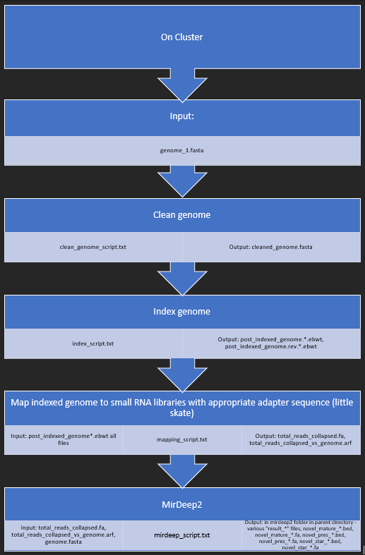
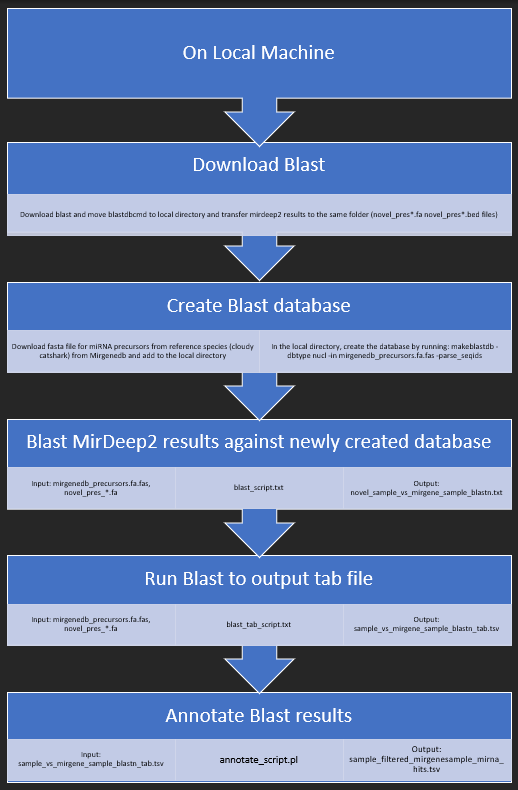
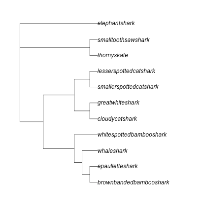
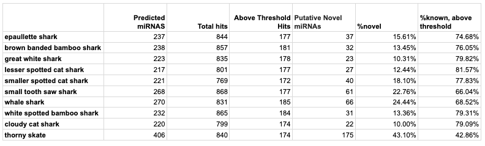

# Classifying Chondrichthyan microRNA Families
Author: Hannah Zenas

## Overview:
Repository for MirDeep2 results for ten chondrichthyan species' genomes against little skate small RNA libraries to determine novel and conserved miRNA families across the species.

## Table of Contents

<a href="#Reference Genomes">Reference Genomes</a></br>
<a href="#MirDeep2 Workflow">MirDeep2 Workflow</a></br>
<a href="#Blast Workflow">Blast Workflow</a></br>
<a href="#Results">Results</a></br>
</br>

## <a name="Reference Genomes">Reference Genomes</a>
Ten species were utilized in this analysis and were determined by their belonging to the chondrichthyes class containing cartilaginous fishes such as sharks, rays, and skates. To note, the elasmobrach class, which also contains cartilaginous fishes, would be considered an outgroup in this study. The ten species selected were those that had reference genomes available on NCBI or GenomeArk and were determined by their genome quality, prioritizing chromosomes above scaffolds and lastly contigs, all of which were chosen by those with the highest n50 length. Below are the species and links to their reference genomes used in this analysis.

Brown Banded Bamboo Shark, Chiloscyllium punctatum: https://www.ncbi.nlm.nih.gov/data-hub/assembly/GCA_003427335.1/

Cloudy Catshark, Scyliorhinus torazame: https://www.ncbi.nlm.nih.gov/data-hub/assembly/GCA_003427355.1/

Epaullette Shark, Hemiscyllium ocellatum: https://www.ncbi.nlm.nih.gov/data-hub/assembly/GCA_020745735.1/

Great White Shark, Carcharodon carcharias: https://www.ncbi.nlm.nih.gov/data-hub/assembly/GCF_017639515.1/

Lesser Spotted Catshark, Scyliorhinus canicula: https://vgp.github.io/genomeark/Scyliorhinus_canicula/ 

Smaller Spotted Catshark, Scyliorhinus canicula: https://www.ncbi.nlm.nih.gov/data-hub/assembly/GCA_902713615.2/

Smalltooth Sawfish, Pristis pectinata: https://www.ncbi.nlm.nih.gov/data-hub/assembly/GCA_009764475.2/

Thorny Skate, Amblyraja radiata: https://www.ncbi.nlm.nih.gov/data-hub/assembly/GCF_010909765.2/

Whale Shark, Rhincodon typus: https://www.ncbi.nlm.nih.gov/data-hub/assembly/GCA_001642345.3/

White Spotted Bamboo Shark, Chiloscyllium plagiosum: https://www.ncbi.nlm.nih.gov/data-hub/assembly/GCF_004010195.1/ 

Outgroup:
Elephant Shark, Callorhinchus milii: https://www.ncbi.nlm.nih.gov/data-hub/assembly/GCF_018977255.1/
 

# <a name="MirDeep2 Workflow">MirDeep2 Workflow</a>
This analysis is broken into two main portions: identifying known and novel miRNAs using MirDeep2 and classifying known miRNAs with Blast. For all scripts and workflows, I will be using the Thorny Skate as the example but file names can be substituted for the appropriate species. 

MirDeep2 Documentation: https://github.com/rajewsky-lab/mirdeep2/blob/master/documentation.html
 


1. Download reference sequences for publicly available skate, ray, and shark genomes and upload to cluster.
2. In the appropriate species directory, copy the genome to have a back up, extract the genome headers to observe possible unwanted whitespaces or noncanonical characters. Then clean up the reference genome using the cleaning script (scripts/thornyskate_clean_genome_script.txt). 
3. Once the reference genome is cleaned, create an index to the genome that will be used for mapping using the indexing script (scripts/thornyskate_index_script.txt).
4. Map the cleaned and indexed genome to known RNAseq reads (in this case, Little Skate RNAseq library). Input the appropriate adapter sequences in the mapping script (scripts/thornyskate_mapping_script.txt).
5. Run MirDeep2 with the newly mapped RNAs using the MirDeep2 script (scripts/thornyskate_mirdeep2_script.txt)
6. Lastly, export the MirDeep2 results to local machine using sftp or Cyberduck (https://cyberduck.io/).

# <a name="Blast Workflow">Blast Workflow</a>
The MirDeep2 results will have generated files containing miRNAs found from the reference genomes. These can now be analyzed against known miRNAs using Blast. 


1. Download blast (https://blast.ncbi.nlm.nih.gov/Blast.cgi?CMD=Web&PAGE_TYPE=BlastDocs&DOC_TYPE=Download) and move blastcdbcmd to the same working directory as the MirDeep2 result files.
2. Create a Blast database using known miRNAs. MirGeneDB is a great database for known miRNAs (https://mirgenedb.org/download). In this study the cloudy catshark miRNAs were used (https://mirgenedb.org/browse/sto). In the working directory, run the following code to create the database:
```{bash eval=FALSE}
~/ncbi-blast-2.9.0+/bin/makeblastdb -dbtype nucl -in cloudycatshark.fa.fas -parse_seqids
```
3. Blast MirDeep2 novel precursors against the newly created database using the following command:
```{bash eval=FALSE}
~/ncbi-blast-2.9.0+/bin/blastn -db cloudycatshark.fa.fas -query novel_pres_mirdeep2_output.fa -out novel_sample_vs_cloudycatshark_blastn.txt -word_size 11 -evalue 1000
```
4. Run Blast to output a .tab file version to be annotated in the next step:
```{bash eval=FALSE}
~/ncbi-blast-2.9.0+/bin/blastn -db ~/path/to/cloudycatshark.fa.fas -query ~/path/to/novel_pres_mirdeep2_output.fa -evalue 1000 -word_size 11 -out sample_vs_cloudycatshark_blastn_tab.tsv -outfmt 6
```
5. Annotate Blast results using the annotating script (/scripts/annotatescript_ts.pl). Currently, the threshold for annotating miRNAs is 50% but this can be altered to achieve narrower or wider query hit ranges.

Note: It is good practice at this point to conduct a reciprocal blast by repeating the above steps but rather than using the mirGene or known miRNAs as the database to Blast against, concatenate all the MirDeep2 novel precursors for all species analyzed and create a Blast database out of these, then Blast the mirGene or known miRNAs to the new database. 


# <a name="Results">Results</a>
The annotation step above will generate a .tsv file that will list what miRNAs that were detected from MirDeep2 belongs to what miRNA family known from the known miRNA database used from the Blast. At this point, data from this annotated file can be joined with the raw data from the MirDeep2 .bed file with novel precursors to identify unique or known miRNA families discovered in the sample and construct a PA matrix using the PA matrix phangorn script (scripts/phangorn_ape_mathod.R).

The PA matrix shows the relationship among the species analyzed in regards to their conserved miRNA families, the matrix file can be found under /blast_results/PA_Matrix - PA_Matrix.csv. 


A table was made to show the percent conserved and novel miRNAs discovered across all species:



### A Special Thanks
This pipeline was developed under the guidance and advisement of Dr. Benjamin King and Kayla Barton.


